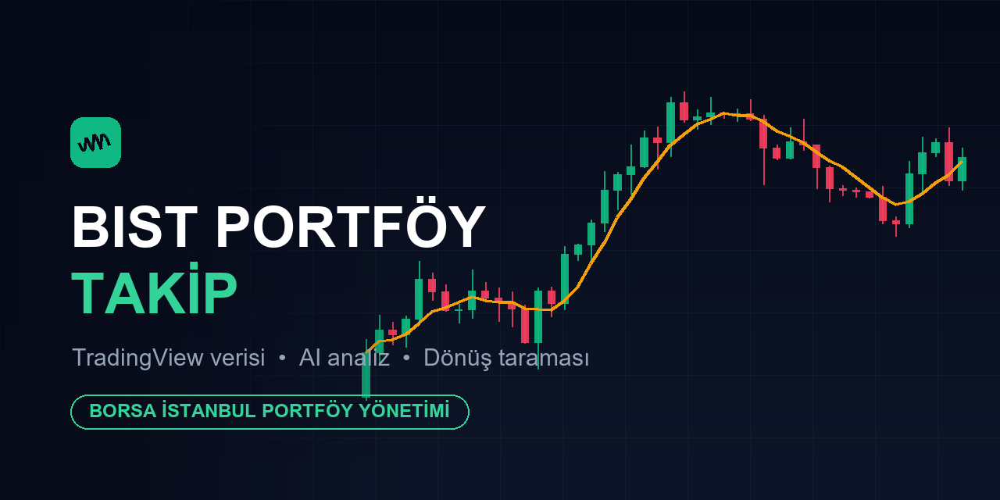

# BIST Portföy Takip

Borsa İstanbul portföy takip uygulaması: TradingView canlı verisi, temel/teknik/AI hisse analizi,
trend-dönüş taraması (RSI uyumsuzluğu, MACD, Supertrend, EMA, hacim, yapı kırılımı), izleme listesi ve hisse notları.

## Run Locally

**Prerequisites:**  Node.js

1. Install dependencies:
   `npm install`
2. Set the `GEMINI_API_KEY` in [.env.local](.env.local) to your Gemini API key
3. Run the app:
   `npm run dev`
